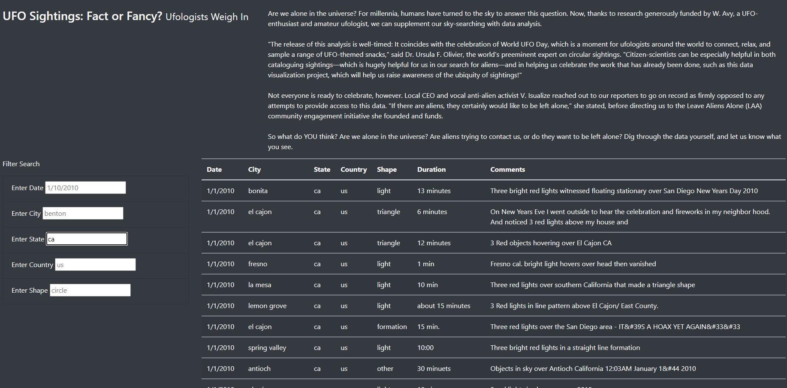
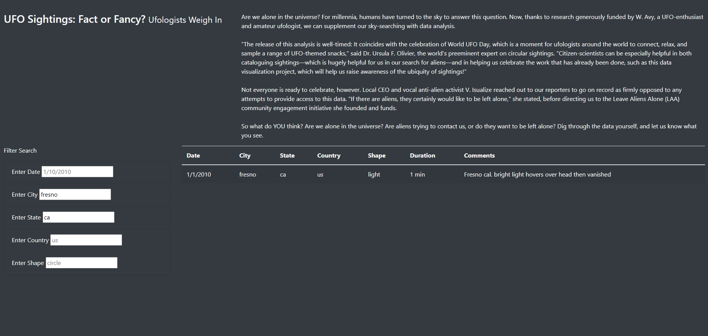

# UFOs
## Overview of Project
This analysis provides a convinient method of searching for UFO sightings of 2010, with the ability to filter by date, city, state, country, and shape of UFO.

## Results
The search function can be used by entering a search term into any of the filter boxes and then pressing Enter. If multiple searches are requested, continue using more of the filter boxes as required. Below are two searches, one is just the state of california, the second is both the state of california and the city of fresno.

## Summary
A disadvantage of this method is the requirment to search for one filter at a time, and would not be able to handle simultaneous searching. 
A possible way to improve the interface would be to add a "clear all filters" button, allowing the original table to be viewed without resetting the page. Additionally, updating the filters could be delayed until a button was pressed to run all the filters at once.